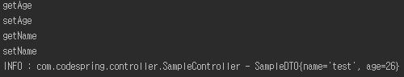

# 스프링 MVC 설정

(mariadb jdbc를 사용하면 jdbcUrl을 인식 못하여 mysql connector로 변경)

(mysql connector 5.1 이상부터 타임존을 인식 못해 url 뒤에 서버 타임존 추가)

### 1. 스프링 MVC 로딩 구조
- web.xml에서 applicationContext.xml을 읽어들임
- webApplicationContext안에 bean 생성 후 의존성 처리
- DispatcherServlet에서 서블릿 관련 설정 동작
- 모델2 방식으로 처리

### 2. 스프링 Controller
- @RequestMapping을 사용하여 url을 매핑시켜줌
    - methond속성으로 get, post, put, delete 사용 가능
- http://url?name=test&age=26 형식으로 파라메터를 수집하면 getter 메소드로 정보를 가져와 setter로 수집

- @RequestParam : 파라미터로 사용된 변수의 이름과 전달되는 파라미터의 이름이 다를 경우 사용
- @InitBinder : 들어온 데이터를 Date같은 타입으로 변환해야될 때 사용(변수에 @DateTimeFormat 사용해도 가능)
- **Model** : JSP에 생성된 데이터를 전달하는 역할, request.setAttribute() 같은 역할을 함
    - @ModelAttribute : 기본자료형을 화면에 전달하기위한 어노테이션
- Controller의 리턴타입
    1. void : url 경로 그대로
    2. String : 상황에 따라 원하는 페이지로 연결가능
    3. 객체 : 주로 JSON을 만드는데 이용
    4. ResponseEntity : 원하는 헤더 정보나 데이터 전달
- 예외처리
    1. <u>@ExceptionHandler</u>(선언된 예외 타입을 처리)와 <u>@ControllerAdvice</u>(스프링 컨트롤러에서 발생하는 예외를 처리)